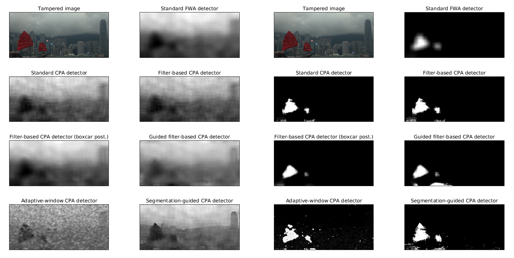
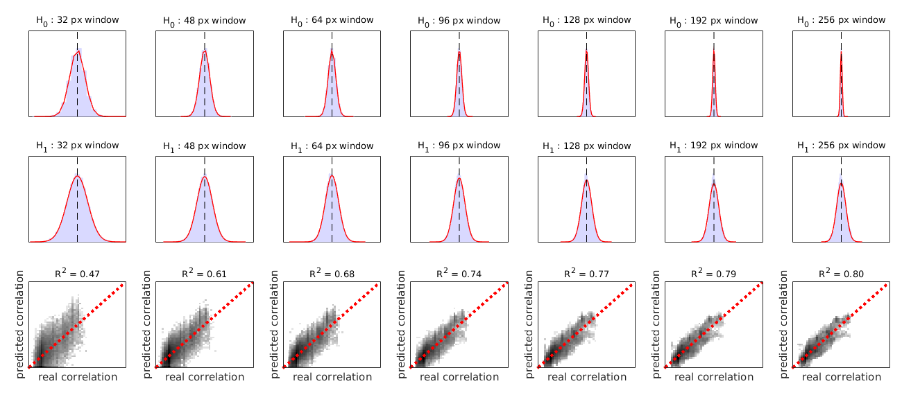
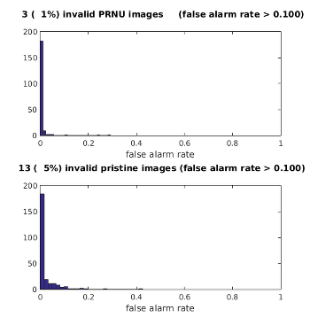

# Multi-scale Analysis Strategies in PRNU-based Tampering Localization

Implementation of multi-scale analysis strategies for tampering localization in digital image forensics. Three strategies are implemented for a well-known PRNU-based detector:

- multi-scale fusion strategy,
- segmentation-guided strategy,
- adaptive-window strategy.

The algorithms are described in detail in the following publications:

1. P. Korus & J. Huang, Multi-Scale Fusion for Improved Localization of Malicious Tampering in Digital Images, IEEE Trans. Image Processing, 2016, [doi: 10.1109/TIP.2016.2518870](http://dx.doi.org/10.1109/TIP.2016.2518870)

2. P. Korus & J. Huang, Multi-scale Analysis Strategies in PRNU-based Tampering Localization, IEEE Trans. Information Forensics & Security, 2017


## Usage and Citations

If you use this code or the datasets in your research, please cite the following papers (Bibtex definitions):

```
@article{Korus2016TIFS,
	Author = {P. Korus and J. Huang},
	Journal = {IEEE Trans. on Information Forensics \& Security},
	Title = {Multi-scale Analysis Strategies in PRNU-based Tampering Localization},
	year={2017}
}
```

```
@article{Korus2016TIP,
	Author = {P. Korus and J. Huang},
	Journal = {IEEE Trans. on Image Processing},
	Title = {Multi-Scale Fusion for Improved Localization of Malicious Tampering in Digital Images},
	year={2016},
  volume={25},
	number={3},
	pages={1312-1326},
	doi={10.1109/TIP.2016.2518870},
	ISSN={1057-7149}
}
```

This code is intended for research and educational purposes. No warranty or support of any kind are provided whatsoever. Before publication, the code went through quite a lot of refactoring to make it understandable and reasonably commented. If you find any bugs or some new ways to improve the techniques, let me know.

## Getting Started

It's simple (prompts: `#` - shell; `>>` - matlab):

```
# git clone https://github.com/pkorus/multiscale-prnu
# cd multiscale-prnu
# ./configure.py dependencies
# ./configure.py data:maps
```

```
>> make_all
>> setup
>> demo_localization
>> demo_fusion
```

The `./configure.py dependencies` command will download and install the necessary 3rd-party dependencies:
- the UGM toolbox for working with undirected graphical models,
- max-flow computation routines for faster GraphCuts,
- PRNU processing routines.

Notes:

- The `setup` command is needed every time you start matlab. It will configure the Matlab's search path.
- The configuration script assumes that you have Python with urllib2 installed and unzip in your path.
- The script contains some basic error checking, but this may not be enough for all problems. In case the process fails, you may wish to cleanup (`./configure.py clean`) and retry. If the problem persists, you can install the dependencies manually (see last section of this documentation).
- Windows users: see last section of this documentation for manual dependencies installation, and navigate to http://kt.agh.edu.pl/~korus for manual dataset download.

## Available localization Algorithms

The toolbox provides a reference implementation of simple PRNU-based tampering localization algorithms. The algorithms assume that the PRNU pattern is already synchronized with the expected signature in the investigated image (i.e., will not work on images that underwent geometrical processing like scaling, cropping or lens distortion compensation). Available functions include:

Function | Description
---------|-------------
`detectForgeryPRNU` | Sliding window detector with full-window attribution
`detectForgeryPRNUAdaptiveWnd` | Sliding window detector with adaptive window size and central pixel attribution
`detectForgeryPRNUCentral` | Sliding window detector with central pixel attribution and optional segmentation guidance
`detectForgeryPRNUFilter` | Alternative implementation with correlation field computed separately by means of image filtering (allows to use a guided filter)
`detectForgeryPRNUMultiscale` | Simple wrapper that simplifies multi-scale processing

Behavior of these algorithms can be compared using the `test_localization.m` script. The script should produce the following result:



## Decision Fusion

Once a multi-scale set of candidate tampering maps has been obtained, the maps can be fused into a single decision map. Available fusion algorithms include:

Function | Description
---------|------------
`fuseAdaptWnd` | Chooses the smallest reliable analysis window for every location in the image; analogous to `detectForgeryPRNUAdaptiveWnd`
`fuseCRF` | Fuses all candidate maps based on a conditional random field with adaptive neighborhood interactions

For more information about these algorithms, please refer to the papers referenced above.

The `fuseCRF` function can also be used for:
- final decision in a standard single-scale scenario; adoption of neighborhood interactions and exploitation of image content can furher improve localization performance.
- tampering map fusion in a multi-modal analysis scenario; in such scenario, remember to set threshold drift strength to zero.

## Where do I go from here? Supplementary datasets.

While verification of PRNU signatures is already well established in image forensics research, the idea of multi-scale analsysis is a new problem. It is still not clear what fusion / analysis techniques are best for various detectors. Some techniques (e.g., the included adaptive-window strategy - see `detectForgeryPRNUAdaptiveWnd.m` and `fuseAdaptWnd.m`) can be implemented both as fusion or analaysis.

The code comes with two datasets that you may wish to use in your experiments:
- candidate tampering probability maps (~140 MB)
- full-size authentic and tampered images (~1.2 GB)

To simplify the process, you can download them as follows:
```
# ./configure.py data:maps
# ./configure.py data:pixmaps
```

Alternatively, to download the datasets manually, visit http://kt.agh.edu.pl/~korus.

## BYOD - Bring Your Own Data

Working with your own data is very simple. You can import an external dataset using `importDataset` function, e.g.:

```
>> importDataset('Nikon_D7000', '/media/storage/raise/Nikon_D7000')
```

The function will automatically divide the images into separate sub-sets for PRNU estimation, predictor training and further testing. You can of course do this manually. Note that the framework works on `TIF` files (uppercase extension). The expected folder structure is:

```
./data-input/(camera_name)/{predictor,pristine,prnu,tampered-realistic}
```

### Camera Model Training

To build a model of the camera, use the `trainCameraModel`  function. It will:

- estimate the PRNU
- train PRNU correlation predictors for the H1 hypothesis for various analysis window sizes
- estimate the variance of the PRNU correlation for the H0 hypothesis for various analysis window sizes

The training can be customized. For more information, please refer to documentation of the `trainCameraModel` function. The example command below will train a PRNU model for the Nikon D7000 camera with BM3D denoising (noise std 3.0) and train the predictor on JPEG compressed patches (random quality factor from 75 to 100):
```matlab
>> trainCameraModel('Nikon D7000', [128], [], struct('noise_sigma', 3.0, 'jpeg_quality', [75 100], 'noise_method', 'bm3d'))
```

The process can be stopped and resumed at any time (with single full step accuracy). In order to overwrite existing predictors, set the `rebuild_predictors` parameter to true.

Once the training is complete, use the `viewCameraModel` function to print the model summary and visualize its components. Pay particular attention to the quality of the estimated predictors (ideally R^2 should be approaching 1).

```matlab
>> viewCameraModel('{Camera Name}')
```

```
Camera model:
   name      : Nikon_D7000
   prnu      : 1080 x 1920 x 3
   # images  : 200
   croppig   : middle
   jpeg      : none
   features  : unspecified (default)
   predictor : unspecified (linear regression)
   denoising : wavelet with sigma = 0.5

scale	R^2	std H0	std H1 [x 1,000]
   32	0.47	31.40	43.07	 (predicted from 25000 patches) max observed cor = 0.34
   48	0.61	20.71	32.30	 (predicted from 25000 patches) max observed cor = 0.28
   64	0.68	15.75	27.58	 (predicted from 25000 patches) max observed cor = 0.27
   96	0.74	10.46	23.37	 (predicted from 25000 patches) max observed cor = 0.24
  128	0.77	 7.92	21.45	 (predicted from 25000 patches) max observed cor = 0.23
  192	0.79	 5.29	19.93	 (predicted from 25000 patches) max observed cor = 0.22
  256	0.80	 4.04	19.28	 (predicted from 25000 patches) max observed cor = 0.22
```

An example visualization result is shown below:



A helper script (`train_cam_models_batch`) will repeat camera model training for various standard deviations of the noise. The script will also summarize the changes in the model performance to help choose the best one.

### Data Set Verification

The toolbox contains a simple function to validate the data-set and camera model. Verification involves launching the tampering detection procedure on pristine image to verify whether the camera model has been build and calibrated properly. False positives will typically happen in saturated and highly textured areas.

In order to run the verification procedure:

```matlab
>> validateDataset('{Camera Name}')
```

The results are cached in `validation.mat` for future reuse. Delete this file to repeat the validation procedure.

An example report will look as follows:
```
Camera name        : Nikon_D7000
Decision threshold : 0.75
Tested images      : 200 (prnu)
Tested images      : 250 (pristine)

  3 (  1%) invalid PRNU images     (false alarm rate > 0.100)
 13 (  5%) invalid pristine images (false alarm rate > 0.100)

15 pristine images with the worst FP rates:
  1. r90ab5181t.TIF --> false alarm rate = 0.43
  2. r52aab659t.TIF --> false alarm rate = 0.26
  3. r486ba8a4t.TIF --> false alarm rate = 0.19
  4. r8cb546a3t.TIF --> false alarm rate = 0.18
  5. r373f2e19t.TIF --> false alarm rate = 0.17
  6. r3cc56786t.TIF --> false alarm rate = 0.15
  7. ra4a6f7a0t.TIF --> false alarm rate = 0.15
  8. r775839dft.TIF --> false alarm rate = 0.13
  9. r5452231at.TIF --> false alarm rate = 0.11
 10. rb78bd5cct.TIF --> false alarm rate = 0.11
 11. r4bf01c53t.TIF --> false alarm rate = 0.11
 12. r123c6433t.TIF --> false alarm rate = 0.10
 13. r78045dadt.TIF --> false alarm rate = 0.10
 14. r1dd9d6bft.TIF --> false alarm rate = 0.10
 15. rb638c950t.TIF --> false alarm rate = 0.09

```

Example visualization is shown below.



## Dependencies

The code requires some 3-rd party dependencies. They can be acquired from websites listed below. If you choose to install them manually, you may need to adjust the paths in `setup.m` and `make_all.m`. By default, the toolbox is expecting them in `3rd-party/(ugm|max-flow|dde-prnu)`.

**UGM Toolbox**

- Web: http://www.cs.ubc.ca/~schmidtm/Software/UGM.html
- Direct download: http://www.cs.ubc.ca/~schmidtm/Software/UGM_2011.zip

**Max-flow**

- Web: http://vision.csd.uwo.ca/code/
- Direct download: http://vision.csd.uwo.ca/code/maxflow-v3.01.zip
- Matlab wrapper (included): http://www.mathworks.com/matlabcentral/fileexchange/21310-maxflow


**PRNU processing**
- Web: http://dde.binghamton.edu/
- Direct download:  http://dde.binghamton.edu/download/camera_fingerprint/CameraFingerprint_1.0.zip


**BM3D**

The framework allows to substitute standard wavelet denoising with BM3D (set `noise_method` to `bm3d` when training your camera model). Since this feature has not been tested extensively, it will not work by default (bm3d is not downloaded during framework setup). If you'd like to play around with this feature, download and add BM3D routines to the Matlab's path manually.

- Web: http://www.cs.tut.fi/~foi/GCF-BM3D
